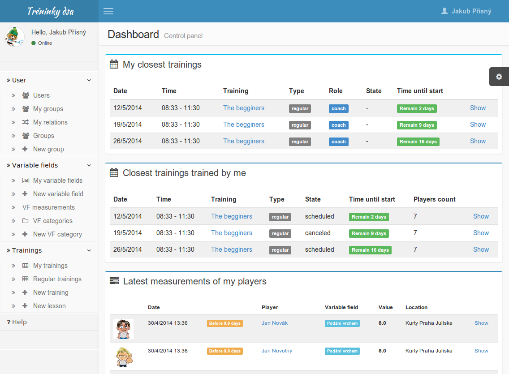
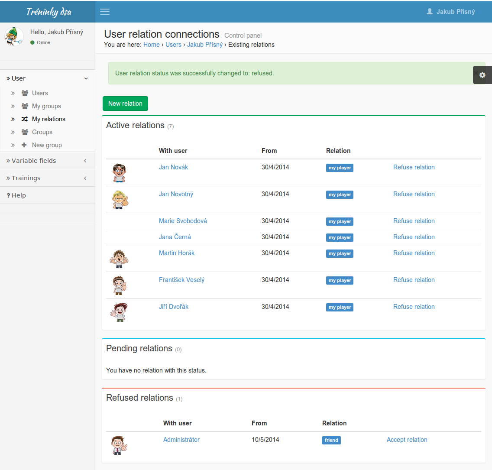
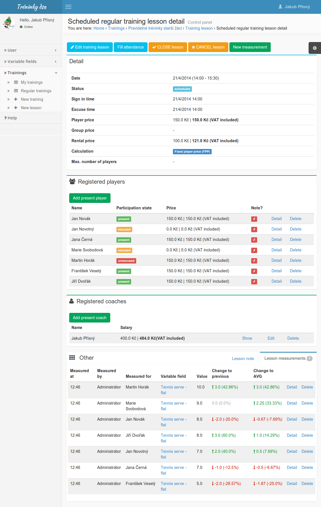
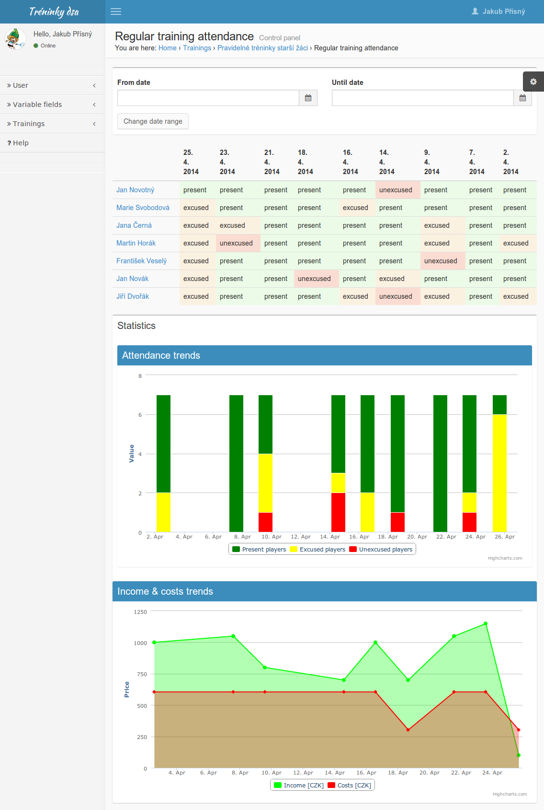
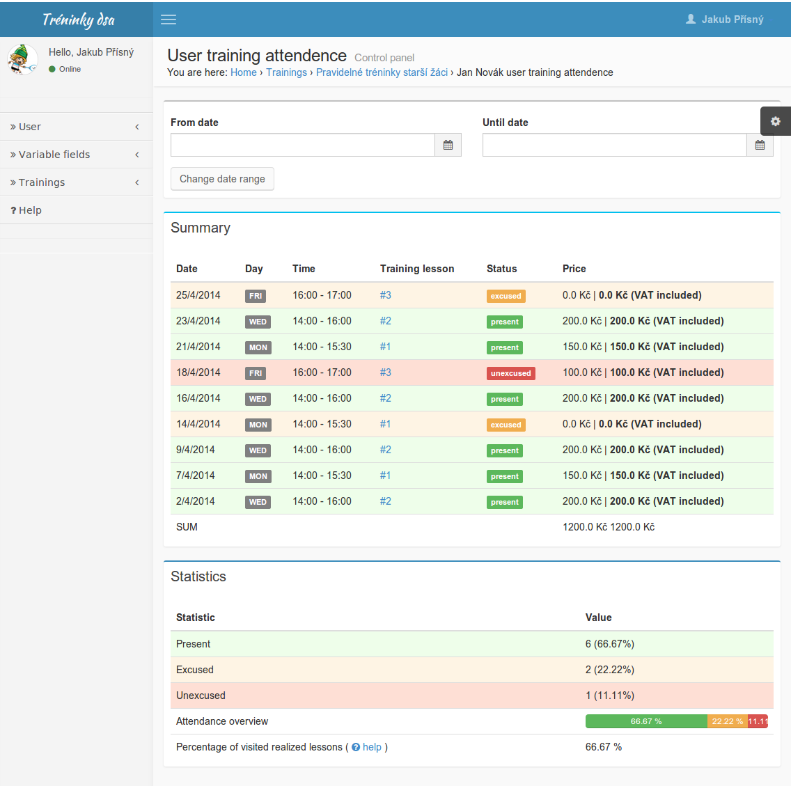
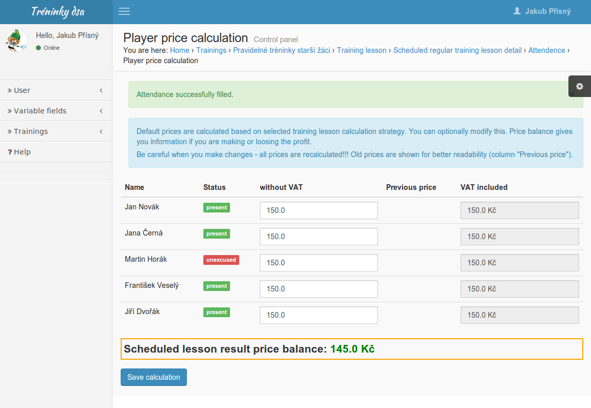
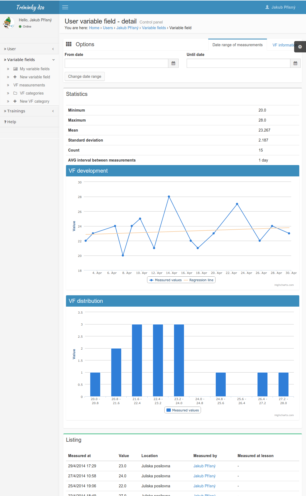

# Featured application parts
Currently no detailed description is written. I believe that it is not required and most of screens are simple
to understand. Provided screenshots do not have to agree with latest application release!

## Dashboard

## User relations

## Scheduled regular training lesson

## Regular training attendance

## User training attendance

## Player price training lesson calculation

## User metric detail

